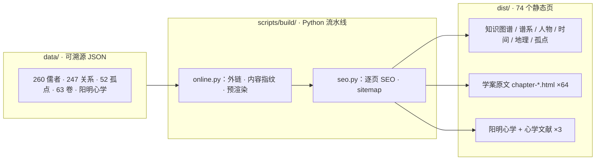

# 名儒学案图谱


把黄宗羲《明儒学案》六十三卷读成一张可溯源的师承知识图谱：260 位儒者、247 条关系、63 卷全文——每条线索独立成页，每条关系都能点回原文出处。

**在线体验：https://mingruxuean.pages.dev**



## 目录

- [快速开始](#快速开始)
- [功能](#功能)
- [页面一览](#页面一览)
- [数据可溯源](#数据可溯源)
- [目录结构](#目录结构)
- [开发约定](#开发约定)
- [贡献](#贡献)
- [数据来源](#数据来源)
- [许可证](#许可证)

## 快速开始

```bash
# 1) 构建（线上用的同一条命令）
python3 scripts/build/online.py && python3 scripts/build/seo.py

# 2) 本地预览（数据走 HTTP，需要起服务器）
python3 -m http.server 8080     # http://localhost:8080

# 3) 部署
git push origin main            # 静态托管平台自动重建 dist/ 并发布
```

## 功能

- **五条线索切入**：知识图谱（D3 力导向）、谱系总图、人物名录、时间轴、地理分布；支持 `index.html?focus=王阳明` 等深链聚焦。
- **全文可读**：63 卷每卷独立页面（`chapter-twelve.html`），可直接深链；64 个卷页共用同一对指纹化 CSS/JS，浏览器强缓存跨页复用。
- **每条关系可溯源**：247 条师承关系，174 条带卷次与原文引文；四路来源（《明史》人工精读 / 63 卷正则抽取 / 旧抽 / 手绘边）按置信度加权，上限 0.99。
- **孤点不是缺数据**：52 个不连线点按 5 类归因（编纂设计 / 横向结社 / 附传 / 未立传 / 真缺口），结论存在 `data/orphans.json`，补齐后页面自动更新。
- **SEO 友好**：文本页在构建期预渲染成静态 HTML，爬虫无 JS 也能读到正文；每页独立 title / description / keywords / JSON-LD。
- **原创研究**：阳明心学四句教图解 + 体用论 / 功夫论 / 病药论三篇文献，署名作者，依 CC BY-NC 4.0 授权。

## 页面一览

| 页面 | 内容 |
|---|---|
| `index.html` | 知识图谱（默认首页，可 `?focus=` / `?orphans=1`） |
| `graph.html` · `roster.html` · `time.html` · `geo.html` | 谱系 · 人物 · 时间 · 地理四条线索 |
| `orphan.html` | 孤点现象与分类归因 |
| `chapter-Preface.html` · `chapter-*.html` | 学案原文：卷前三篇（三个 tab）+ 63 卷各一页 |
| `yangming.html` · `lit-*.html` | 阳明心学图解 + 心学文献三篇 |

## 数据可溯源

每条师承关系都带出处，例如：

```json
{
  "from": "冯应京", "to": "邹元标", "type": "师承",
  "sources": ["legacy-mining", "mined"], "confidence": 0.99,
  "provenance": [{
    "volume": 24, "section": "佥事冯慕冈先生应京",
    "quote": "……先生师事邹南臬……", "method": "regex-mining"
  }]
}
```

## 目录结构

```
├── src/          前端源码（分层，每文件 ≤300 行）
│   ├── core/        总线 / 状态 / DOM 工具——不认识业务
│   ├── data/        仓库 / 领域模型 / 图模型 / 古文渲染
│   ├── engines/     布局与交互引擎（纯函数，零 import）
│   ├── router/      旧链接重定向
│   ├── controllers/ 编排：听事件、取数据、喂视图
│   ├── views/       只管画，不存状态
│   ├── pages/       每页入口（控制本页打包体积）
│   ├── sections/    每个分类一个 <section> 内容块
│   └── styles/      一视图一份 CSS
├── data/         ★ JSON 数据库：7 份核心 + volumes/63 卷 + yangming.json + schema/
├── scripts/      ingest/（原文→结构化）· build/（online.py 构建，seo.py SEO）· pipeline.py 一键跑通
├── resources/    原始素材（63 卷原文、明史儒林传、阳明手稿页、心学文献）
├── tests/        零依赖测试（数据 20 · 源码 13 · 构建 16 · 浏览器冒烟 52 · 在线核验 11）
├── ARCHITECTURE.md   架构说明
├── DATA.md           数据字典
└── dist/         构建产物（gitignore，现场生成，不入库）
```

## 开发约定

1. 每个 js / css 文件 ≤300 行（测试会卡）。
2. 分层不许倒挂：engines 零 import；views 不碰 store；只有 `data/repository.js` 能 `fetch`。
3. 数据只有一个真相：孤点数只登记在 `orphans.json`，不重复存。

```bash
python3 tests/run.py            # 全量（含浏览器冒烟）
python3 tests/run.py --no-web   # 跳过浏览器，快速
```

## 贡献

- 发现数据问题（人物、关系、出处）→ 开 Issue，附卷次与原文。
- 改动代码 → 先跑 `python3 tests/run.py --no-web`，再提 PR。
- 架构细节见 [ARCHITECTURE.md](ARCHITECTURE.md)，字段含义见 [DATA.md](DATA.md)，更新记录见 [CHANGELOG.md](CHANGELOG.md)。

## 数据来源

《明儒学案》六十三卷及卷前三篇整理自 [维基文库](https://zh.wikisource.org)（zh.wikisource.org），儒林传考据来自《明史》；相关古籍原文属公共领域。

## 许可证

本仓库采用**分许可（split license）**模式：

| 内容 | 许可 |
|---|---|
| 软件代码（`src/` `scripts/` 等） | [MIT](LICENSE) |
| 原创研究文字（阳明心学 + 心学文献三篇） | [CC BY-NC 4.0](RESEARCH-LICENSE.md) |
| 古籍原文（《明儒学案》《明史》） | 公共领域 |
